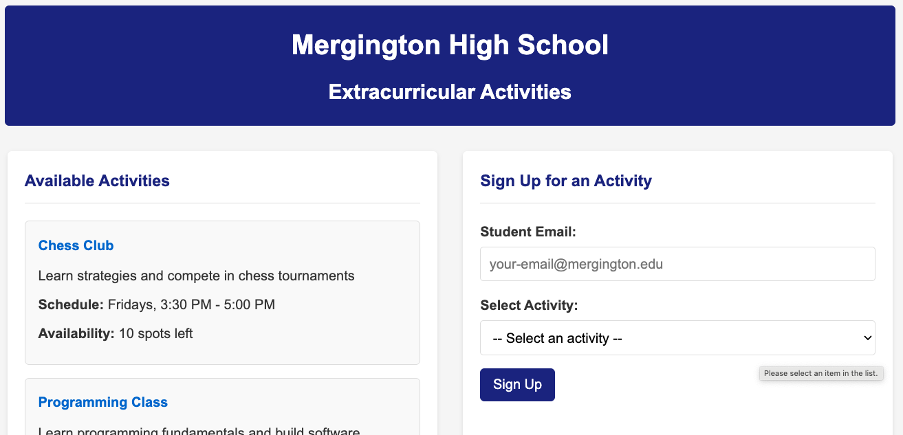
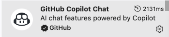
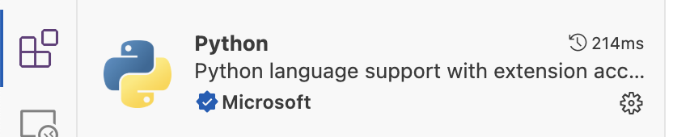
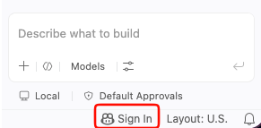
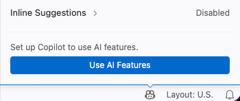
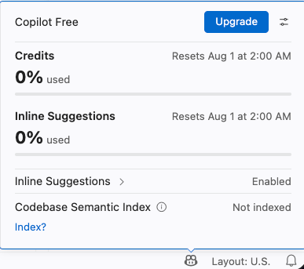
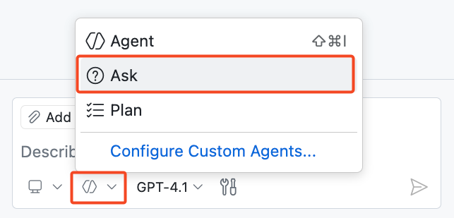
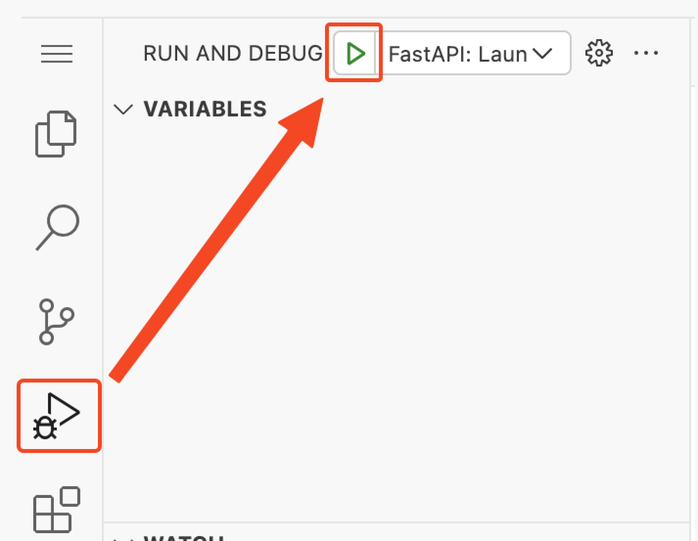
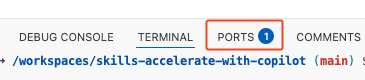

## Passo 1: Olá, Copilot

Boas-vindas ao seu exercício **"Primeiros Passos com o GitHub Copilot"**! :robot:

Neste exercício, você vai usar diferentes recursos do GitHub Copilot para trabalhar em um site que permite que estudantes da Mergington High School se inscrevam em atividades extracurriculares. 🎻 ⚽️ ♟️



### 📖 Teoria: conhecendo o GitHub Copilot


O GitHub Copilot é um assistente de programação com IA que ajuda você a escrever código mais rápido e com menos esforço, permitindo concentrar mais energia na resolução de problemas e na colaboração.

Já foi comprovado que o GitHub Copilot aumenta a produtividade de quem desenvolve e acelera o ritmo do desenvolvimento de software. Para mais informações, veja [Research: quantifying GitHub Copilot’s impact on developer productivity and happiness no blog do GitHub.](https://github.blog/news-insights/research/research-quantifying-github-copilots-impact-on-developer-productivity-and-happiness/)

Enquanto você trabalha na sua IDE, normalmente vai interagir com o GitHub Copilot das seguintes formas:

| Modo de interação        | 📝 Descrição                                                                                                                    | 🎯 Melhor para                                                                                                  |
| ------------------------- | ------------------------------------------------------------------------------------------------------------------------------ | --------------------------------------------------------------------------------------------------------------- |
| **⚡ Inline suggestions** | Sugestões de código com IA que aparecem conforme você digita, oferecendo complementos conscientes do contexto, de linhas únicas a funções inteiras. | Completar a linha atual e, às vezes, um bloco inteiro de código                                                 |
| **💭 Inline Chat**        | Chat interativo com escopo no arquivo ou na seleção atual. Faça perguntas sobre blocos específicos de código.                     | Explicações de código, depuração de funções específicas, melhorias pontuais                                        |
| **💬 Ask Mode**           | Otimizado para responder perguntas sobre sua base de código, programação e conceitos gerais de tecnologia.                        | Entender como o código funciona, gerar ideias, tirar dúvidas                                                    |
| **🤖 Agent Mode**         | Modo padrão recomendado para a maioria das tarefas de programação: edições autônomas, uso de ferramentas e acompanhamento até concluir a tarefa. | Tarefas diárias de programação, de correções pontuais a implementações maiores em vários arquivos                |
| **🧭 Plan Agent**         | Otimizado para elaborar um plano e fazer perguntas de esclarecimento antes de qualquer alteração de código.                       | Quando você quer primeiro um plano revisado e depois repassar para a implementação                               |

Conforme você trabalha, vai perceber que o GitHub Copilot ajuda em vários lugares do site `github.com` e nos seus ambientes de programação favoritos, como VS Code, JetBrains e Xcode!

Hoje, porém, vamos praticar com o VS Code em um ambiente de desenvolvimento pré-configurado conhecido como [GitHub Codespace](https://github.com/features/codespaces).

> [!TIP]
> Você pode saber mais sobre os recursos atuais e futuros na documentação de [GitHub Copilot Features](https://docs.github.com/en/copilot/about-github-copilot/github-copilot-features).

### :keyboard: Atividade: receba uma introdução ao projeto pelo Copilot Chat

Vamos iniciar nosso ambiente de desenvolvimento, usar o Copilot para aprender um pouco sobre o projeto e, em seguida, testá-lo.

1. Use o botão abaixo para abrir a página **Create Codespace** em uma nova aba. Use a configuração padrão.

   [](https://codespaces.new/{{full_repo_name}}?quickstart=1)

1. Confirme que o campo **Repository** aponta para a sua cópia do exercício, e não para o original, e então clique no botão verde **Create Codespace**.
   - ✅ Sua cópia: `/{{full_repo_name}}`
   - ❌ Original: `/dev-pods/skills-getting-started-with-github-copilot`

1. Aguarde um momento até o Visual Studio Code carregar no seu navegador.
1. Na barra lateral esquerda, clique na aba de extensões e verifique se as extensões `GitHub Copilot Chat` e `Python` estão instaladas e habilitadas.

   

   

   <details>
   <summary>🔎 A extensão GitHub Copilot Chat está faltando ❓</summary>

   Se a extensão GitHub Copilot Chat não aparecer para você, verifique se você está autenticado no GitHub Copilot. Procure o ícone do **GitHub Copilot** no canto inferior direito da janela do VS Code.

   | Ícone na barra de status                                                                                                | Login necessário                                                                                         | Copilot ativo                                                                                                   |
   | ----------------------------------------------------------------------------------------------------------------------- | -------------------------------------------------------------------------------------------------------- | --------------------------------------------------------------------------------------------------------------- |
   |  |  |  |

   A partir daqui você deve estar pronto para seguir, mesmo que a extensão ainda não apareça na aba de extensões.

   </details>

1. No topo do VS Code, localize e clique no ícone **Toggle Chat** para abrir o painel lateral do Copilot Chat.

   

   > 🪧 **Observação:** se esta for a sua primeira vez usando o GitHub Copilot, talvez seja necessário aceitar os termos de uso para continuar.


1. Certifique-se de estar no **Ask Mode** para nossa primeira interação.

   

1. Digite o prompt abaixo para pedir ao Copilot que apresente o projeto para você.

   > 
   >
   > ```prompt
   > Explique brevemente a estrutura deste projeto.
   > O que eu preciso fazer para executá-lo?
   > ```

   > 🪧 **Observação:** não é necessário seguir as instruções recomendadas pelo Copilot. Já preparamos o ambiente para você.

1. Agora que conhecemos um pouco mais o projeto, vamos realmente executá-lo! Na barra lateral esquerda, selecione a aba `Run and Debug` e clique no ícone **Start Debugging**.

   

1. Queremos ver nossa página rodando em um navegador, então vamos descobrir a URL e a porta. Se não estiver visível, expanda o painel inferior e selecione a aba **Ports**.

1. Na lista, encontre a porta `8000` e o link relacionado. Passe o mouse sobre o link e selecione o ícone **Open in browser**.

   

### :keyboard: Atividade: use o Copilot para lembrar um comando de terminal 🙋

Bom trabalho! Agora que conhecemos a aplicação e sabemos que ela funciona, vamos pedir ajuda ao Copilot para criar uma branch e fazer algumas personalizações.

1. No painel inferior do VS Code, selecione a aba **Terminal** e, do lado direito, clique no sinal de mais `+` para criar uma nova janela de terminal.

   > 🪧 **Observação:** isso evita interromper a sessão de debug existente que está hospedando o serviço da nossa aplicação web.

1. Na nova janela de terminal, use o atalho de teclado `Ctrl + I` (Windows) ou `Cmd + I` (Mac) para abrir o **Terminal Inline Chat do Copilot**.

1. Vamos pedir ao Copilot que nos ajude a lembrar um comando que esquecemos: criar uma branch e publicá-la.

   > 
   >
   > ```prompt
   > Ei Copilot, como eu crio e publico uma nova branch do Git chamada "accelerate-with-copilot"?
   > ```

   > 💡 **Dica:** se o Copilot não devolver exatamente o que você quer, você sempre pode continuar explicando o que precisa. O Copilot lembra do histórico da conversa nas respostas seguintes.

1. Pressione o botão `Run` para deixar o Copilot inserir o comando no terminal para nós. Sem precisar copiar e colar!

1. Depois de um instante, olhe na barra de status inferior do VS Code, à esquerda, para ver a branch ativa. Ela deve indicar `accelerate-with-copilot`. Se sim, você concluiu este passo!

1. Agora que sua branch foi enviada para o GitHub, a Mona já deve estar verificando seu trabalho. Dê um tempo a ela e fique de olho nos comentários. Você verá a resposta dela com informações de progresso e a próxima lição.

<details>
<summary>Com dificuldades? 🤷</summary><br/>

Se você não receber retorno, confira alguns pontos:

- Verifique se você criou a branch com o nome exato `accelerate-with-copilot`. Sem prefixos ou sufixos.
- Verifique se a branch foi realmente publicada no seu repositório.

</details>
