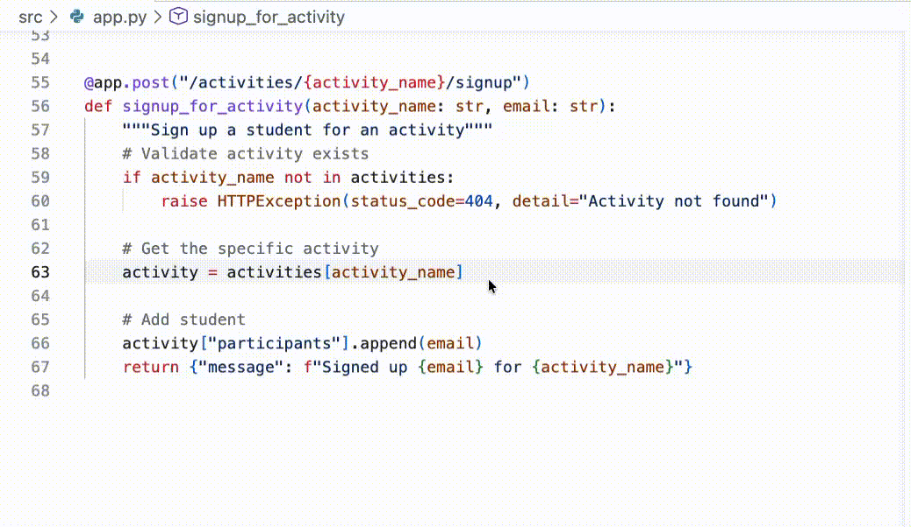
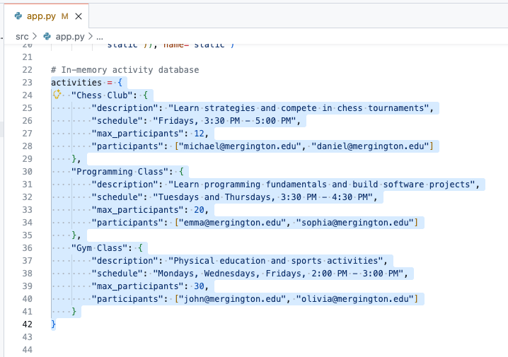
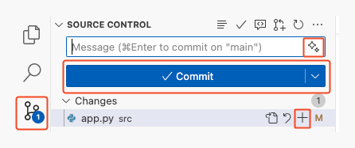

## Passo 2: Colocando o trabalho em dia com o Copilot

No passo anterior, o GitHub Copilot nos ajudou a entrar no projeto. Só isso já economiza muito tempo, mas agora vamos trabalhar de verdade!

:bug: **HÁ UM BUG NO SITE** :bug:

Descobrimos que algo está errado no fluxo de inscrição.
As pessoas estudantes conseguem se inscrever na mesma atividade **mais de uma vez**! Vamos ver até onde o Copilot consegue nos levar para descobrir a causa e construir uma correção limpa.

Antes de mergulhar, uma breve introdução sobre como o Copilot funciona. 🧑‍🚀

### 📖 Teoria: como o Copilot funciona

Em resumo, você pode pensar no Copilot como um colega de trabalho bem especializado. Para ser efetivo com ele, você precisa fornecer contexto e uma direção clara (prompts). Além disso, pessoas diferentes são boas em coisas diferentes por causa de suas experiências únicas (modelos).

- **Como fornecemos contexto?** No nosso ambiente de desenvolvimento, o Copilot considera automaticamente o código próximo e as abas abertas. Se você estiver usando o chat, também pode referenciar arquivos explicitamente.

- **Qual modelo devemos escolher?** Para o nosso exercício, não deve fazer muita diferença. Experimentar modelos diferentes faz parte da diversão! Isso é assunto para outra lição! 🤖

- **Como faço bons prompts?** Ser explícito e claro ajuda o Copilot a fazer o melhor trabalho. Mas, diferente de alguns sistemas tradicionais, você sempre pode esclarecer a direção com prompts de acompanhamento.

> [!TIP]
> Existem várias outras formas de complementar o conhecimento e as capacidades do Copilot, como [chat participants](https://docs.github.com/en/copilot/using-github-copilot/copilot-chat/github-copilot-chat-cheat-sheet?tool=vscode#chat-participants), [chat variables](https://docs.github.com/en/copilot/using-github-copilot/copilot-chat/github-copilot-chat-cheat-sheet?tool=vscode#chat-variables), [slash commands](https://docs.github.com/en/copilot/using-github-copilot/copilot-chat/github-copilot-chat-cheat-sheet?tool=vscode#slash-commands-1) e [MCP tools](https://code.visualstudio.com/docs/copilot/chat/mcp-servers).

### :keyboard: Atividade: use o Copilot para corrigir nosso bug de inscrição :bug:

1. Vamos pedir ao Copilot que sugira de onde pode vir o nosso bug. Abra o painel do **Copilot Chat** no **Ask mode** e pergunte o seguinte.

   > 
   >
   > ```prompt
   > #codebase As pessoas estudantes conseguem se inscrever duas vezes em uma atividade.
   > De onde pode estar vindo esse bug?
   > ```

1. Agora que sabemos que o problema está no arquivo `src/app.py` e no método `signup_for_activity`, vamos seguir a recomendação do Copilot e corrigi-lo (de forma semimanual). Vamos começar com um comentário e deixar o Copilot finalizar a correção.
   1. Abra o arquivo `src/app.py`.

      > 💡 **Dica:** se o Copilot mencionou `src/app.py` no chat, você pode clicar no arquivo diretamente na visualização do chat para abri-lo.

   1. Perto do final do arquivo, encontre a função `signup_for_activity`.

   1. Encontre a linha de comentário que descreve a adição de um estudante. Logo acima dela parece o lugar lógico para fazer nossa verificação de inscrição.

   1. Digite o comentário abaixo e pressione Enter para ir para a próxima linha. Depois de um instante, um texto sombreado temporário aparecerá com uma sugestão do Copilot! Muito bom! :tada:

      Comentário:

      ```python
      # Validate student is not already signed up
      ```

      

   1. Pressione `Tab` para aceitar a sugestão do Copilot e converter o texto sombreado em código.

   <details>
   <summary>Exemplo de resultado</summary><br/>

   O Copilot evolui todos os dias e nem sempre produz os mesmos resultados. Se você não gostar das sugestões, aqui está um exemplo de resultado válido que produzimos durante a criação deste exercício. Você pode usá-lo para seguir adiante.

   ```python
   @app.post("/activities/{activity_name}/signup")
   def signup_for_activity(activity_name: str, email: str):
      """Sign up a student for an activity"""
      # Validate activity exists
      if activity_name not in activities:
         raise HTTPException(status_code=404, detail="Activity not found")

      # Get the activity
      activity = activities[activity_name]

      # Validate student is not already signed up
      if email in activity["participants"]:
        raise HTTPException(status_code=400, detail="Student is already signed up")

      # Add student
      activity["participants"].append(email)
      return {"message": f"Signed up {email} for {activity_name}"}
   ```

   </details>

### :keyboard: Atividade: deixe o Copilot gerar dados de exemplo 📋

Em projetos novos, costuma ser útil ter dados fictícios com aparência realista para testes. O Copilot é excelente nessa tarefa, então vamos adicionar mais atividades de exemplo e conhecer outra forma de interagir com o Copilot: o **Inline Chat**.

O **Inline Chat** e o painel do **Copilot Chat** são parecidos, mas diferem no escopo: o Copilot Chat lida com perguntas mais amplas, exploratórias ou envolvendo vários arquivos; o Inline Chat é mais rápido quando você quer ajuda direcionada na linha ou no bloco exatamente à sua frente.

1. Perto do topo do arquivo `src/app.py` (por volta da linha 23), encontre a variável `activities`, onde as atividades extracurriculares de exemplo estão configuradas.

1. Selecione todo o dicionário `activities` clicando e arrastando o mouse do topo até o final do dicionário. Isso ajuda a fornecer contexto ao Copilot para o nosso próximo prompt.

   


1. Abra o inline chat do Copilot usando o atalho de teclado `Ctrl + I` (Windows) ou `Cmd + I` (Mac).

   > 💡 **Dica:** outra forma de abrir o inline chat do Copilot é: `clique com o botão direito` em qualquer uma das linhas selecionadas -> `Open Inline Chat`.

1. Digite o prompt a seguir e pressione Enter ou o botão **Send**, à direita.

   > 
   >
   > ```prompt
   > Adicione mais 2 atividades esportivas, mais 2 atividades artísticas
   > e mais 2 atividades intelectuais.
   > ```

1. Depois de um instante, o Copilot começará a fazer alterações diretamente no código. As mudanças terão um estilo diferente para facilitar a identificação de adições e remoções. Reserve um momento para inspecionar e validar as alterações e então pressione o botão **Keep**.

   <details>
   <summary>Exemplo de resultado</summary><br/>

   O Copilot evolui todos os dias e nem sempre produz os mesmos resultados. Se você não gostar das sugestões, aqui está um exemplo de resultado que produzimos durante a criação deste exercício. Você pode usá-lo para seguir adiante, caso tenha dificuldades.

   ```python
   # In-memory activity database
   activities = {
      "Chess Club": {
         "description": "Learn strategies and compete in chess tournaments",
         "schedule": "Fridays, 3:30 PM - 5:00 PM",
         "max_participants": 12,
         "participants": ["michael@mergington.edu", "daniel@mergington.edu"]
      },
      "Programming Class": {
         "description": "Learn programming fundamentals and build software projects",
         "schedule": "Tuesdays and Thursdays, 3:30 PM - 4:30 PM",
         "max_participants": 20,
         "participants": ["emma@mergington.edu", "sophia@mergington.edu"]
      },
      "Gym Class": {
         "description": "Physical education and sports activities",
         "schedule": "Mondays, Wednesdays, Fridays, 2:00 PM - 3:00 PM",
         "max_participants": 30,
         "participants": ["john@mergington.edu", "olivia@mergington.edu"]
      },
      "Basketball Team": {
         "description": "Competitive basketball training and games",
         "schedule": "Tuesdays and Thursdays, 4:00 PM - 6:00 PM",
         "max_participants": 15,
         "participants": []
      },
      "Swimming Club": {
         "description": "Swimming training and water sports",
         "schedule": "Mondays and Wednesdays, 3:30 PM - 5:00 PM",
         "max_participants": 20,
         "participants": []
      },
      "Art Studio": {
         "description": "Express creativity through painting and drawing",
         "schedule": "Wednesdays, 3:30 PM - 5:00 PM",
         "max_participants": 15,
         "participants": []
      },
      "Drama Club": {
         "description": "Theater arts and performance training",
         "schedule": "Tuesdays, 4:00 PM - 6:00 PM",
         "max_participants": 25,
         "participants": []
      },
      "Debate Team": {
         "description": "Learn public speaking and argumentation skills",
         "schedule": "Thursdays, 3:30 PM - 5:00 PM",
         "max_participants": 16,
         "participants": []
      },
      "Science Club": {
         "description": "Hands-on experiments and scientific exploration",
         "schedule": "Fridays, 3:30 PM - 5:00 PM",
         "max_participants": 20,
         "participants": []
      }
   }
   ```

   </details>

1. Agora você pode acessar seu site e verificar se as novas atividades estão visíveis.

### :keyboard: Atividade: use o Copilot para descrever nosso trabalho 💬

Excelente trabalho corrigindo aquele bug e ampliando as atividades de exemplo! Agora vamos fazer o commit e o push do nosso trabalho para o GitHub, novamente com a ajuda do Copilot!

1. Na barra lateral esquerda, selecione a aba `Source Control`.

   > 💡 **Dica:** abrir um arquivo pela área de source control mostra as diferenças em relação ao original, em vez de simplesmente abri-lo.

1. Encontre o arquivo `app.py` e pressione o sinal `+` para reunir suas alterações na área de staging.

   

1. Acima da lista de alterações em staging, encontre a caixa de texto **Message**, mas **não digite nada** por enquanto.
   - Normalmente você escreveria aqui uma breve descrição das alterações, mas agora temos o Copilot para ajudar!

1. À direita da caixa de texto **Message**, encontre e clique no botão **Generate Commit Message** (ícone de estrelinhas).

1. Pressione o botão **Commit** e depois **Sync Changes** para enviar suas alterações ao GitHub.

1. Aguarde um momento até a Mona verificar seu trabalho, dar retorno e compartilhar a próxima lição.

<details>
<summary>Com dificuldades? 🤷</summary><br/>

Se você não receber retorno, confira alguns pontos:

- Verifique se você enviou as alterações do arquivo `src/app.py` para a branch `accelerate-with-copilot`.

</details>
