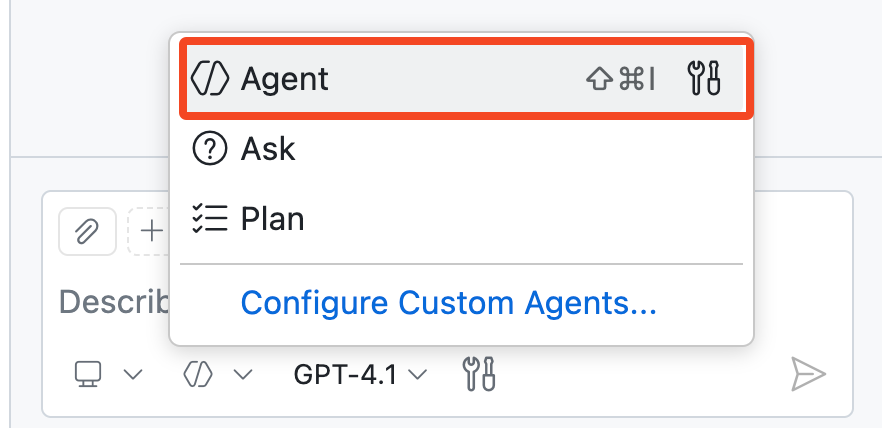
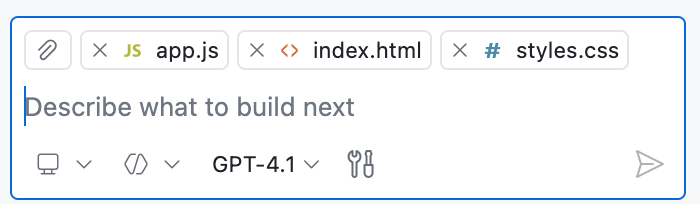
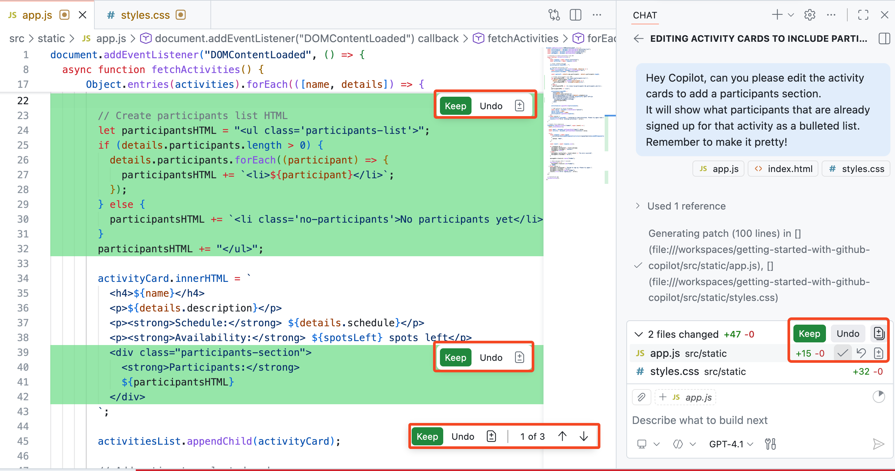
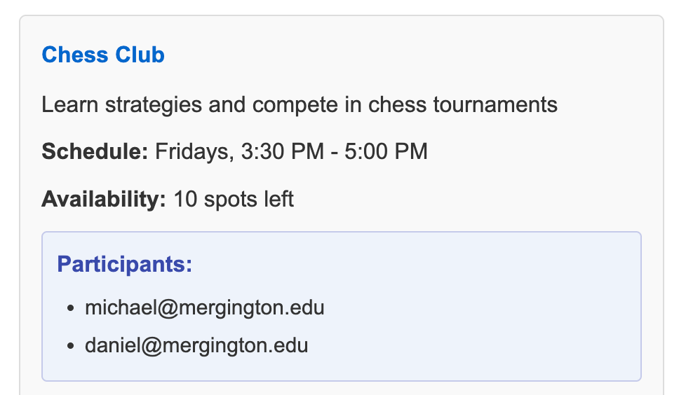
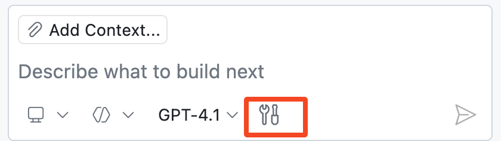

## Passo 3: Ativando a hipervelocidade — Copilot Agent Mode 🚀

### 📖 Teoria: o que é o Copilot Agent Mode?

O [agent mode](https://code.visualstudio.com/docs/copilot/chat/chat-agent-mode) do Copilot é a próxima evolução da programação assistida por IA. Atuando como um par de programação autônomo, ele executa tarefas de várias etapas sob seu comando.

O Copilot Agent Mode reage a erros de compilação e de lint, monitora a saída do terminal e dos testes e se autocorrige em ciclo até concluir a tarefa.

#### Agent Mode (visão geral)

| Aspecto | 👩‍🚀 Agent Mode |
| --- | --- |
| Autonomia e planejamento | Divide solicitações de alto nível em trabalho de várias etapas e itera até a tarefa ser concluída. |
| Coleta de contexto | Usa seu contexto atual e pode descobrir outros arquivos relevantes quando necessário. |
| Uso de ferramentas | Seleciona e invoca ferramentas automaticamente; você também pode direcionar ferramentas com menções como `#codebase`. |
| Aprovação e barreiras de segurança | Ações sensíveis podem exigir aprovação antes da execução, ajudando você a manter o controle. |

#### 🧰 Ferramentas do Agent Mode

O agent mode usa ferramentas para realizar tarefas especializadas enquanto processa uma solicitação. Alguns exemplos dessas tarefas são:

- Encontrar arquivos relevantes para atender ao seu prompt
- Buscar o conteúdo de uma página web
- Executar testes ou comandos de terminal

> [!TIP]
> Embora o VS Code ofereça muitas ferramentas integradas, você também pode dar ao Agent Mode poderes mais específicos do seu domínio por meio de **MCP tools**.
>
> Leia mais sobre [MCP servers](https://code.visualstudio.com/docs/copilot/customization/mcp-servers) e [GitHub MCP Server](https://github.com/github/github-mcp-server)

Agora vamos experimentar o **Agent Mode**! 👩‍🚀

### :keyboard: Atividade: use o Copilot para adicionar um novo recurso! :rocket:

Nosso site lista as atividades, mas mantém a lista de participantes em segredo 🤫

Vamos usar o Copilot para alterar o site e exibir as pessoas estudantes inscritas em cada atividade!

1. Na parte inferior da janela do Copilot Chat, use o menu suspenso para alternar para o modo **Agent**.

   

1. Abra os arquivos relacionados à nossa página e arraste cada janela do editor (ou arquivo) para o painel do chat, informando ao Copilot que ele deve usá-los como contexto.

   - `src/static/app.js`
   - `src/static/index.html`
   - `src/static/styles.css`

   > 🪧 **Observação:** adicionar arquivos como contexto é opcional. Se você pular esta etapa, o Copilot Agent Mode ainda pode usar ferramentas como `#codebase` para buscar arquivos relevantes a partir do seu prompt. Adicionar arquivos específicos ajuda a apontar o Copilot na direção certa, o que é especialmente útil em bases de código maiores.

   

   > 💡 **Dica:** você também pode usar o botão **Add Context...** para fornecer outras fontes de contexto, como uma issue do GitHub ou o resultado de uma janela de terminal.

1. Peça ao Copilot para atualizar nosso projeto e exibir as pessoas participantes das atividades. Aguarde um momento até as sugestões de edição chegarem e serem aplicadas.

   > 
   >
   > ```prompt
   > Ei Copilot, você pode editar os cards de atividade para adicionar uma seção de participantes?
   > Ela deve mostrar, em uma lista com marcadores, as pessoas já inscritas naquela atividade.
   > Lembre-se de deixar bonito!
   > ```

   Depois que o Copilot terminar, você decide quais alterações permanecem.

   Usando os botões **Keep** mostrados abaixo, você pode aceitar/descartar todas as alterações ou revisar e decidir uma a uma. Isso pode ser feito tanto pelo painel do chat quanto ao inspecionar cada arquivo editado.

      


1. Antes de simplesmente aceitar as alterações, verifique novamente nosso site e confirme se tudo foi atualizado como esperado.
   
   Aqui está um exemplo de card de atividade atualizado. Talvez seja necessário reiniciar a aplicação ou atualizar a página.

   

   > 🪧 **Observação:** seu card de atividade pode ficar diferente. O Copilot nem sempre produz os mesmos resultados.

   <details>
   <summary>Precisa de ajuda? 🤷</summary><br/>
   Se o site não carregar, confira alguns pontos.

   - Reinicie o debugger do VS Code para garantir que a versão mais recente do site seja servida.
   - Se você esqueceu a URL ou fechou a janela, revise o passo 1.
   - Tente atualizar a página forçando a recarga ou abri-la em uma janela anônima para baixar uma cópia nova.

   </details>

1. Agora que confirmamos que nossas alterações estão boas, use o painel para percorrer cada edição sugerida e pressione **Keep** para aplicar a alteração.

   > 💡 **Dica:** você pode aceitar as alterações diretamente, modificá-las ou fornecer instruções adicionais para refiná-las pela interface de chat.

### :keyboard: Atividade: use o Agent mode para adicionar botões funcionais de "cancelar inscrição"

Vamos experimentar solicitações mais abertas, que vão adicionar mais funcionalidades à nossa aplicação web.

Se você não obtiver o resultado desejado, pode tentar outros modelos ou dar retorno em prompts de acompanhamento para refinar os resultados.

1. Confirme que o Copilot ainda está no modo **Agent**.

   

1. Clique no ícone **Tools** e explore todas as ferramentas atualmente disponíveis para o Copilot Agent Mode.

   

1. Hora do nosso teste! Vamos pedir ao Copilot que adicione a funcionalidade de remover participantes.

   > 
   >
   > ```prompt
   > #codebase Adicione um ícone de exclusão ao lado de cada participante e oculte os marcadores da lista.
   > Ao ser clicado, ele deve cancelar a inscrição daquele participante na atividade.
   > ```

   A ferramenta `#codebase` é usada pelo Copilot para encontrar arquivos e trechos de código relevantes para a tarefa em questão.

   > 🪧 **Observação:** neste laboratório incluímos explicitamente a ferramenta `#codebase` para obter os resultados mais repetíveis possíveis.
   > Sinta-se à vontade para testar o prompt **sem** o `#codebase` e observar se o Agent Mode decide por conta própria coletar um contexto mais amplo do projeto.

1. Quando o Copilot terminar, inspecione as alterações de código e os resultados no site. Se você gostar do resultado, pressione o botão **Keep**. Caso contrário, tente dar algum retorno ao Copilot para refinar os resultados.

   > 🪧 **Observação:** se você não vir as atualizações no site, talvez seja necessário reiniciar o debugger.

1. Peça ao Copilot para corrigir um bug de inscrição.

   > 💡 **Dica:** recomendamos testar o fluxo de inscrição você mesmo, para ver claramente o comportamento antes/depois das alterações.

   > 
   >
   > ```prompt
   > Percebi que parece haver um bug.
   > Quando um participante é inscrito, a página precisa ser atualizada para que a mudança apareça na atividade.
   > ```

1. Quando o Copilot terminar, inspecione os resultados e valide o fluxo de inscrição no site.

   Se você gostar do resultado, pressione o botão **Keep**. Caso contrário, tente dar algum retorno ao Copilot.

1. Faça **commit** e **push** de todas as suas alterações para a branch `accelerate-with-copilot`.

1. Aguarde a Mona verificar seu trabalho e compartilhar o próximo passo.