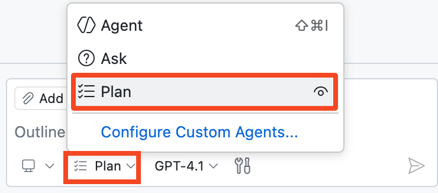
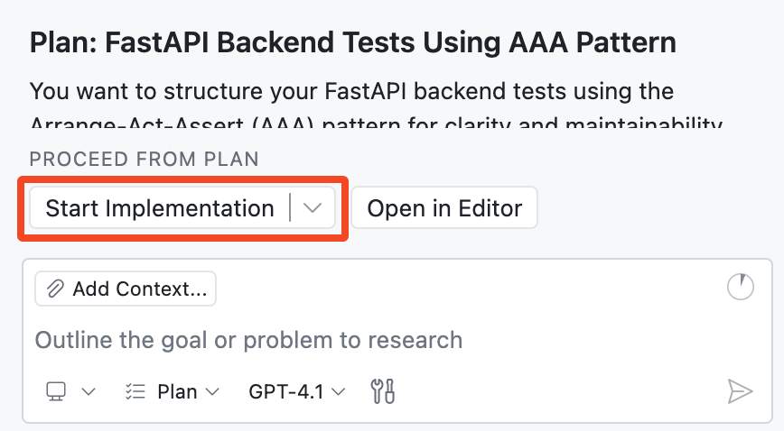

## Passo 4: Planeje sua implementação com o Planning Agent 🧭

No último passo, o Agent Mode nos ajudou a avançar rápido e entregar novas funcionalidades. 🚀

Agora vamos desacelerar por uma rodada e trabalhar como pessoas arquitetas: primeiro definir uma boa abordagem de testes e depois repassar para a implementação. Isso traz mais clareza, menos surpresas e resultados mais limpos. 🧪

### 📖 Teoria: o que é o Copilot Plan Agent?

O [Plan Agent](https://code.visualstudio.com/docs/copilot/agents/planning) do Copilot ajuda você a desenhar uma solução antes de qualquer alteração de código.

Em vez de partir direto para as edições, ele pesquisa sua solicitação, faz perguntas de esclarecimento e elabora um plano de implementação que você pode refinar.

#### Plan Agent (visão geral)

| Aspecto | 🧭 Plan Agent |
| --- | --- |
| Objetivo | Cria um plano de implementação estruturado antes de começar a programar. |
| Coleta de contexto | Usa pesquisa somente leitura para entender requisitos e restrições. |
| Estilo de colaboração | Faz perguntas de esclarecimento e atualiza o plano com suas respostas. |
| Iteração | Permite várias rodadas de refinamento antes da implementação. |
| Segurança | Não edita arquivos até que você aprove o plano e repasse para o **Agent Mode**. |
| Repasse | O botão **Start implementation** entrega o plano aprovado ao **Agent Mode** para a codificação. |

> [!TIP]
> Você pode começar com uma solicitação de alto nível e depois adicionar restrições e detalhes em prompts de acompanhamento.

### ⌨️ Atividade: planejar e implementar os testes de backend

Seu backend ainda está com zero cobertura de testes. Use o **Plan Agent** para criar um plano, responder às perguntas e então iniciar a implementação.

1. Abra o painel do **Copilot Chat** e alterne para o **Plan Agent**.

   


1. Vamos começar com um prompt amplo e o Copilot nos ajudará a preencher os detalhes:

   > 
   >
   > ```prompt
   > Vamos planejar a adição de testes de backend com FastAPI em um diretório de testes separado.
   > ```

1. Aguarde o Copilot gerar seu primeiro plano. Se ele fizer perguntas, responda da melhor forma possível.

   > 🪧 **Observação:** não se preocupe em deixar perfeito, você sempre pode refinar o plano depois.

1. Você pode refinar o plano e fornecer detalhes adicionais em prompts de acompanhamento.

   Alguns exemplos:

   > 
   >
   > ```prompt
   > Vamos usar o padrão de testes AAA (Arrange-Act-Assert) para estruturar nossos testes
   > ```

   > 
   >
   > ```prompt
   > Garanta que usemos `pytest` e adicione-o ao arquivo `requirements.txt`
   > ```


1. Revise o plano proposto e, quando estiver satisfeito, clique em **Start implementation** para repassar ao **Agent Mode**.

   

   Note que clicar no botão alternou do **Plan** para o **Agent Mode**. Deste ponto em diante, o Copilot pode editar sua base de código, como antes.

1. Acompanhe o Copilot implementando o plano que você acabou de criar. Ele pode pedir permissão para executar certas ferramentas (por exemplo, rodar comandos ou criar ambientes virtuais). Aprove essas permissões para que ele possa continuar trabalhando.

1. Revise as alterações e confirme que os testes rodam com sucesso. Se necessário, continue orientando até a implementação ficar completa.

   **🎯 Objetivo: deixar todos os testes passando (verdes) antes de seguir adiante. ✅**

   > 🪧 **Observação:** o Agent Mode pode concluir isso de uma vez ou pode precisar de prompts de acompanhamento seus.

1. Faça **commit** e **push** de todas as suas alterações para a branch `accelerate-with-copilot`.

1. Aguarde a Mona verificar seu trabalho e compartilhar o próximo passo.

<details>
<summary>Com dificuldades? 🤷</summary><br/>

- Se os testes não rodaram, peça ao Copilot que os execute para você.
- Verifique se o `pytest` foi adicionado ao `requirements.txt` e se existe um diretório `tests/`.

</details>
