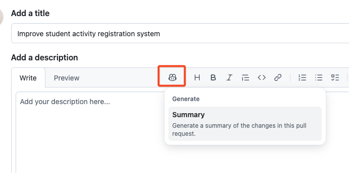
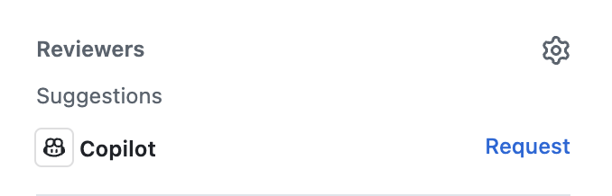

## Passo 5: Usando o GitHub Copilot dentro de um pull request

Parabéns! Você terminou a parte de programação deste exercício (e do VS Code). Agora é hora de fazer o merge do nosso trabalho. :tada: Para encerrar, vamos conhecer dois recursos do Copilot de acesso limitado que podem acelerar nossos pull requests!

### 📖 Teoria: GitHub Copilot para pull requests

#### Copilot pull request summaries

Normalmente, você revisaria suas anotações e mensagens de commit e depois as resumiria na descrição do pull request. Isso pode levar tempo, especialmente se as mensagens de commit forem inconsistentes ou se o código não estiver bem documentado. Felizmente, o Copilot consegue considerar todas as alterações do pull request e apresentar os destaques importantes — com referências, inclusive!

#### Copilot code review

Mais olhos sobre nosso trabalho é sempre útil, então vamos pedir ao Copilot uma primeira passada antes do processo normal de revisão por pares. O Copilot é ótimo em encontrar erros comuns que se resolvem com ajustes simples, mas lembre-se de usá-lo com responsabilidade.

> [!NOTE]
> Esses recursos estão disponíveis apenas nos planos pagos do **GitHub Copilot**. [[docs]](https://docs.github.com/en/copilot/get-started/plans)

### :keyboard: Atividade: resumir e revisar um PR com o Copilot

Tanto o **Copilot pull request summaries** quanto o **Copilot code review** têm acesso limitado, então esta atividade é em grande parte opcional. Se você não tiver acesso, pule as etapas opcionais desta atividade.

1. Em um navegador, abra outra aba e acesse o repositório do seu exercício.

1. Você talvez veja um **banner de notificação** sugerindo a criação de um novo pull request. Clique nele ou use a aba **Pull Requests**, no topo, para **criar um novo pull request**. Use os seguintes detalhes:

   - **base:** `main`
   - **compare:** `accelerate-with-copilot`
   - **title:** `Improve student activity registration system`

1. (Opcional) Na barra de ferramentas da descrição do PR, clique no ícone do **Copilot** e na ação **Summary**. Depois de um instante, o Copilot adicionará uma descrição baseada nas suas alterações. :memo:

   

1. (Opcional) No painel de informações do lado direito, no topo, localize a seção **Reviewers** e clique no botão **Request** ao lado do ícone do **Copilot**. Aguarde um momento até o Copilot adicionar um comentário de revisão ao seu pull request!

   

   > 💡 **Dica:** observe o registro indicando que o Copilot foi solicitado para uma revisão.

1. No final da página, pressione o botão **Merge pull request**. Bom trabalho! Você concluiu tudo! :tada:

1. Aguarde um momento até a Mona verificar seu trabalho, dar retorno e publicar a revisão final deste exercício!
